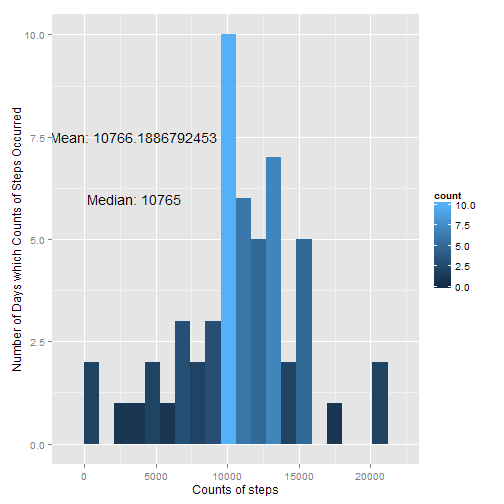
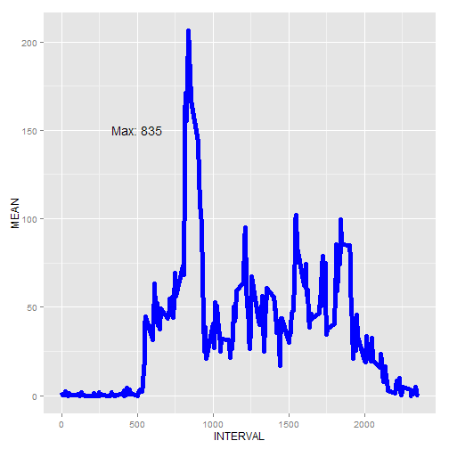
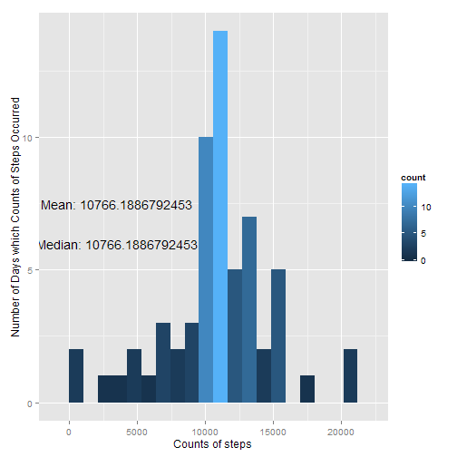
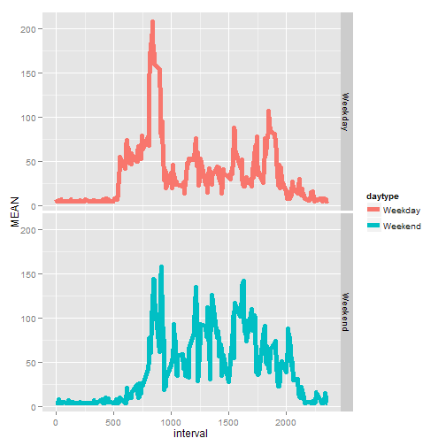

## Introduction
The purpose of this exercise was to demonstrate how "reproducible research" could be conducted. For this exercise, Rmarkdown was used to write a computer-literate program. The program was weaved into a human-readable html file. 

The focus of this exericse was to analyze data collected by a personal activity-monitoring device. The number of steps of a person was monitored over approximately 60 days in increments of 5 minutes. The data was loaded and a brief exploratory analysis was conducted. At one point, missing values were imputed by a "mean of means." Plots of activity suggested a visual difference between steps over Weekends versus Weekdays.  

## Loading and preprocessing the data
The .csv was loaded into a data frame. The library "lubridate" was used to scale all dates to the first occuring date. The column of values thus created was denoted "days."


```r
## Import Data
file_path <- paste0(getwd(),"/activity.csv")
df <- read.table(file_path, strip.white=TRUE,header=TRUE, sep=',')

## Work w/Dates
library(lubridate)
date_col <- ymd(df$date)
df$days <- (date_col - date_col[1])/edays(1)
```

## What is the mean total number of steps taken per day?
The data was plotted via histogram to show which interval had the most steps on average. Functions from the libraries "dplyr" and "tidyr" were used to find the total number of steps for each day. Rows which contained missing values were not included in this calculation.   

The following histogram shows that the most frequent bin contains 10,000 steps. Bins of less than 5,000 steps or more than 15,000 steps occurred less frequently. The mean and median were nearly identical. 


```r
## Remove incomplete cases
df_part1 <- df[complete.cases(df),]

## Steps over 53 days - Not including missing days
library(dplyr)
library(tidyr)
library(ggplot2)

## Calculate sums
sum_steps <- tmp <- NULL
for ( i in unique(df_part1$days) ) {
        tmp <- df_part1 %>% 
                filter(days==i) %>% 
                summarise(SUM=sum(steps))
        sum_steps <- rbind(sum_steps,tmp)
}

## Find mean and save it as character string
text1 <- paste0("Mean: ", 
                as.character(summarise(sum_steps,MEAN=mean(SUM))))

## Find median and save it as character string
text2 <- paste0("Median: ", 
                as.character(summarise(sum_steps,MEDIAN=median(SUM))))

## Histogram
ggplot(sum_steps,aes(x=SUM)) +
        geom_histogram(aes(fill=..count..),binwidth=1060) + 
        labs(x="Counts of steps",y="Number of Days which Counts of Steps Occurred") +
        annotate("text", x=3500, y=7.5, label=text1) + 
        annotate("text", x=3500, y=6.0, label=text2)
```

 

## What is the mean average daily activity pattern?
The steps were collected for each interval and averaged for all days of that interval. The averaged daily intervals seemed to indicate that there was an activity pattern. A line graph revealed that, on average, there was a maxium number of steps in the morning hours. The maximum occurs at 8:35 am.


```r
## What is average daily activity pattern
mean_steps <- tmp <- NULL
for (m in unique(df_part1$interval)) {
        tmp <- df_part1 %>%
                filter(interval==m) %>%
                summarise(MEAN=mean(steps))
        mean_steps <- rbind(mean_steps,tmp)
}

## Create x-axis
mean_steps$INTERVAL <- sort(df_part1[which(df_part1$days==unique(df_part1$days)),3])
## Text
text3 <- paste0("Max: ",
                as.character(filter(mean_steps,MEAN==max(MEAN))[2]))
## Line Plot
ggplot(mean_steps,aes(x=INTERVAL,y=MEAN)) + 
        geom_line(size=2,colour="blue") +
        annotate("text",x=500,y=150,label=text3)
```

 

## Imputing missing values
There are roughly two thousand missing datapoints. A new dataframe was created ("df_part2") and a mean of steps per interval averaged across all days was substitued for the missing values (approx. 37 steps). A histogram of this new dataset (which was calculated in an identical manner to the first), showed that additional days were included in the 10,000 step bin. By imputing the value of 37 for each missing interval/day, data were pulled "inwards" towards the mean and median. Unsurprisingly, the mean was not changed by this imputation. 


```r
## How many NAs?
dim(df)[[1]] - dim(df_part1)[[1]]
```

```
## [1] 2304
```

```r
## Impute interval mean of mean days (mean of mean)
df_part2 <- df
na_index <- which(is.na(df$steps)==TRUE)
## Value is 37.3826
df_part2[na_index,"steps"] <- summarise(mean_steps,x=mean(MEAN))
```

 

## Are there differences in activity patterns between weekdays and weekends? 

The weekdays() function was used to create a new column "DayType," which contained values either "Weekend" or "Weekday." Activity plots were created in an identical manner as previously shown. These plots seemed to visually indicate that there is a difference between the activites as monitored by this personal fitness device of Weekdays and Weekends. Potentially, this person was more active over the weekends than during the week. 


```r
## Number of steps per day
## Create new column consisting of 
## either "Weekends" or "Weekdays"
DayType <- weekdays(as.Date(df_part2$date))
DayType[which(DayType=="Sunday" | DayType=="Saturday")] <- "Weekend"
DayType[which(DayType=="Monday" | DayType=="Tuesday"| DayType=="Wednesday"| DayType=="Thursday"| DayType=="Friday")] <- "Weekday"
df_part2$daytype <- factor(DayType)

## Compare Weekend to Weekday Activity Patterns
plot_data <- df_part2 %>%
        group_by(daytype,interval) %>%
        summarise(MEAN=mean(steps))
## Plot
ggplot(plot_data, aes(x=interval,y=MEAN)) + 
        geom_line(aes(colour=daytype),size=2) +
        facet_grid(daytype~.)
```

 

## Conclusion
Using Rmarkdwon is a strong step towards documenting research in a clear way which allows it to be more easily reproducible. This exercise demonstrated how easy it was to load data, perform an exploratory analysis, and show exactly how it was done. Upon visual inspection, it seems that the subject of this personal activity data was more active over the weekend than the weekdays.   
